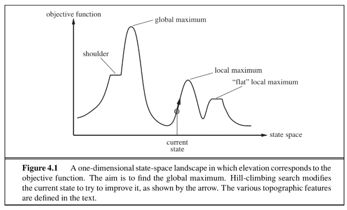
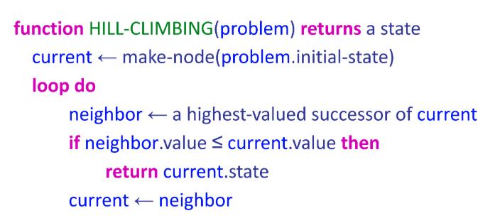

[Reference: CS50 AI - Lecture 3: Optimization](https://cs50.harvard.edu/ai/2020/weeks/3/)

# Hill Climbing Algorithm (Local Search)

## What is Optimization?

**Optimization** = choosing the **best option** from a set of options.

In AI, we often need to find the best configuration, arrangement, or solution among many possibilities.

---

## What is Local Search?

In the previous note, we wanted to find the goal state, along with the optimal path to get there. But in some problems, we only care about finding the goal state — reconstructing the path can be trivial. For example, in Sudoku, the optimal configuration is the goal. Once you know it, you know how to get there by filling in the squares one by one.

Local search algorithms allow us to find goal states without worrying about the path to get there. In local search problems, the state space consists of sets of "complete" solutions. We use these algorithms to try to find a configuration that satisfies some constraints or optimizes some objective function.

The basic idea of local search algorithms is that from each state, they locally move towards states that have a higher objective value until a maximum (hopefully the global one) is reached.

**Local Search** = search algorithms that maintain a **single node** (current state) and search by **moving to a neighboring node**.



| Feature | Classical Search (BFS/DFS/A*) | Local Search (Hill Climbing) |
|---------|-------------------------------|------------------------------|
| Goal | Find a **path** from start to goal | Find the **best configuration** |
| Memory | Stores many nodes (frontier) | Stores only **current state** |
| Exploration | Explores full search tree | Only looks at **neighbors** |
| Guarantee | Can guarantee optimal path | May get stuck at **local optima** |

---

## Key Concepts

### State-Space Landscape

Imagine a landscape where:
- **X-axis** = different possible states (configurations)
- **Y-axis** = value of the objective/cost function

### Terminology

| Term | Definition |
|------|-----------|
| **Objective function** | A function we want to **maximize** (find the global maximum) |
| **Cost function** | A function we want to **minimize** (find the global minimum) |
| **Current state** | Where we are now on the landscape |
| **Neighbor** | A state reachable by a small change from the current state |
| **Global maximum** | The single highest point across all states |
| **Global minimum** | The single lowest point across all states |
| **Local maximum** | Higher than all neighbors, but not the global max |
| **Local minimum** | Lower than all neighbors, but not the global min |
| **Plateau / Shoulder** | Flat area where no direction leads to immediate improvement |

---

## Hill-Climbing Search

The hill-climbing search algorithm (or **steepest-ascent**) moves from the current state towards the neighboring state that increases the objective value the most. The algorithm does not maintain a search tree but only tracks the states and the corresponding values of the objective. The "greediness" of hill-climbing makes it vulnerable to being trapped in **local maxima** (see figure 4.1), as locally those points appear as global maxima to the algorithm, and **plateaus** (see figure 4.1). Plateaus can be categorized into "flat" areas at which no direction leads to improvement ("**flat local maxima**") or flat areas from which progress can be slow ("**shoulders**").

Variants of hill-climbing, like **stochastic hill-climbing** (which selects an action randomly among the possible uphill moves), have been proposed. Stochastic hill-climbing has been shown in practice to converge to higher maxima at the cost of more iterations. Another variant, **random sideways moves**, allows moves that don't strictly increase the objective, helping the algorithm escape "shoulders."

The pseudocode of hill-climbing can be seen below. As the name suggests, the algorithm iteratively moves to a state with a higher objective value until no such progress is possible. Hill-climbing is **incomplete**. **Random-restart hill-climbing**, on the other hand, conducts a number of hill-climbing searches from randomly chosen initial states, making it trivially complete as, at some point, a randomly chosen initial state may converge to the global maximum.

As a note, later in this course, you will encounter the term "**gradient descent**." It is the exact same idea as hill-climbing, except instead of maximizing an objective function, we will want to minimize a cost function.

### Pseudocode



```
function HILL-CLIMB(problem):
    current = initial state of problem
    repeat:
        neighbor = best valued neighbor of current
        if neighbor not better than current:
            return current
        current = neighbor
```

### How It Works (Step by Step)

1. **Start** with a random initial state
2. **Evaluate** all neighboring states
3. **Compare** the best neighbor to the current state
4. **If better** → move to that neighbor, go to step 2
5. **If not better** → STOP, we're at a local optimum

### Variants

| Variant | Strategy |
|---------|----------|
| **Steepest-ascent** | Pick the **single best** neighbor |
| **Stochastic** | Pick **randomly** among better neighbors |
| **First-choice** | Pick the **first** neighbor that is better |
| **Random sideways** | Allow moves that don't strictly improve (escape shoulders) |
| **Random Restart** | Run hill climbing **multiple times**, keep the best result |
| **Simulated Annealing** | Sometimes accept **worse** neighbors (with decreasing probability) |

### The Problem: Local Minima

Hill Climbing is **greedy** — it always moves to the best neighbor. This means it can get **stuck** at local minima (see Figure 4.1 above). The algorithm stops because all neighbors are worse, even though the **global minimum** exists elsewhere.

**Solution:** Random Restart Hill Climbing — run hill climbing many times from different random starting points, and keep the best result.

```
function RANDOM-RESTART(problem, max_restarts):
    best = None
    repeat max_restarts times:
        result = HILL-CLIMB(problem)
        if result better than best:
            best = result
    return best
```

---

## Our Example: Hospital Placement

### Problem Statement

Given:
- A grid of size `height x width`
- Houses at fixed positions on the grid
- `num_hospitals` hospitals to place

**Goal:** Minimize the **total Manhattan distance** from each house to its **nearest hospital**.

### Manhattan Distance

```
distance = |row1 - row2| + |col1 - col2|
```

This is the "city block" distance — no diagonal movement allowed.

### Cost Function

```
cost = sum of (distance from each house to its nearest hospital)
```

Lower cost = better placement.

---

## Code Structure: `hospitals.py`

### The `Space` Class

| Method | Purpose |
|--------|---------|
| `__init__(height, width, num_hospitals)` | Create the grid |
| `add_house(row, col)` | Place a house at a fixed position |
| `available_spaces()` | Return all empty cells (no house, no hospital) |
| `get_cost(hospitals)` | Calculate total distance cost for a hospital configuration |
| `get_neighbors(row, col)` | Return valid adjacent cells (up/down/left/right) |
| `hill_climb(maximum, image_prefix, log)` | Run hill climbing algorithm |
| `random_restart(maximum, image_prefix, log)` | Run hill climbing multiple times |
| `output_image(filename)` | Generate a PNG image of the current state |

### How Neighbors Work

A **neighboring state** is created by moving **one hospital** by **one cell** (up, down, left, or right):

```
Current hospitals: {(2,3), (5,7)}

Possible neighbors by moving hospital (2,3):
  → {(1,3), (5,7)}   # moved UP
  → {(3,3), (5,7)}   # moved DOWN
  → {(2,2), (5,7)}   # moved LEFT
  → {(2,4), (5,7)}   # moved RIGHT

(Plus similar moves for hospital (5,7))
```

Invalid moves (skipped):
- Out of grid bounds
- Cell occupied by a house
- Cell occupied by another hospital

---

## Running the Code

### Prerequisites

```bash
pip install Pillow
```

### Run Hill Climbing

```bash
cd hospitals
python hospitals.py
```

**Output:**
```
Initial state: cost 107
Found better neighbor: cost 97
Found better neighbor: cost 92
...
Found better neighbor: cost 36
```

This also generates images showing each iteration:
- `hospitals000.png` — Initial random placement (Cost: 107)
- `hospitals027.png` — Final optimized placement (Cost: 36)

### Run with Random Restart (modify the script)

Replace the last line in `hospitals.py` with:

```python
hospitals = s.random_restart(maximum=100, log=True)
```

---

## Test Results

### Single Hill Climbing Run

```
Grid: 10 x 20 | Houses: 15 | Hospitals: 3

Initial state: cost 107
  → 28 iterations of improvement
Final state: cost 36
```

| Stage | Hospital Positions | Cost |
|-------|--------------------|------|
| Initial (random) | Scattered far from houses | 107 |
| Final (optimized) | Near clusters of houses | 36 |

### What Happened

1. **3 hospitals** were placed randomly on a 10x20 grid
2. **15 houses** were scattered across the grid
3. Hill climbing moved hospitals **one cell at a time** toward better positions
4. After **28 iterations**, no neighbor was better → algorithm stopped
5. Cost reduced from **107 → 36** (66% reduction)

---

## Files

```
Hill_Climbing/
├── README.md                          ← This file
├── DSE313_AI_Hill_climbing.ipynb      ← Step-by-step tutorial notebook
├── lecture3.pdf                        ← CS50 AI Lecture 3 slides
├── 1.png                              ← State-space landscape (Figure 4.1)
├── 2.png                              ← Hill-Climbing pseudocode image
├── hospitals/                         ← Working copy of the code
│   ├── hospitals.py                   ← Main hill climbing implementation
│   └── assets/
│       ├── images/
│       │   ├── House.png
│       │   └── Hospital.png
│       └── fonts/
│           └── OpenSans-Regular.ttf
└── src3/                              ← Original source (CS50)
    ├── hospitals/                     ← Hospital placement problem
    ├── production/                    ← Production optimization
    └── scheduling/                    ← Scheduling problem
```

---

## Summary

| Concept | Description |
|---------|-------------|
| **Optimization** | Choosing the best option from a set of options |
| **Local Search** | Maintain single state, move to neighbors |
| **Hill Climbing** | Always move to the best neighbor; stop when no improvement |
| **Cost Function** | Sum of Manhattan distances from houses to nearest hospital |
| **Local Minimum** | Better than all neighbors, but not globally optimal |
| **Random Restart** | Run hill climbing many times to escape local minima |
| **Gradient Descent** | Same idea as hill climbing, but minimizing a cost function |
