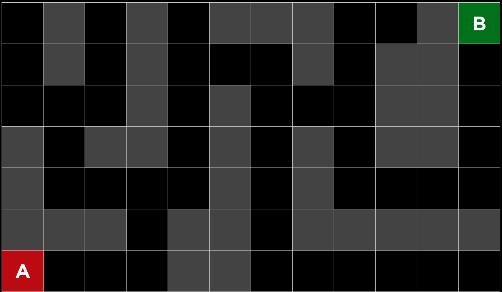
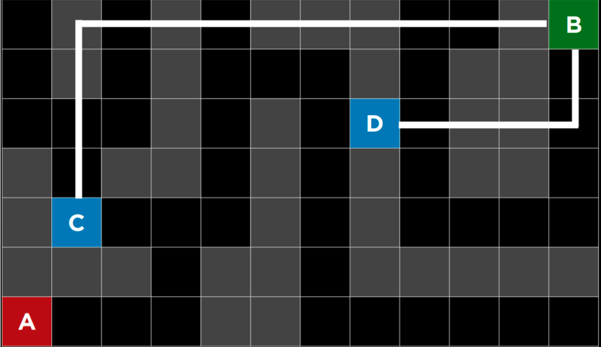
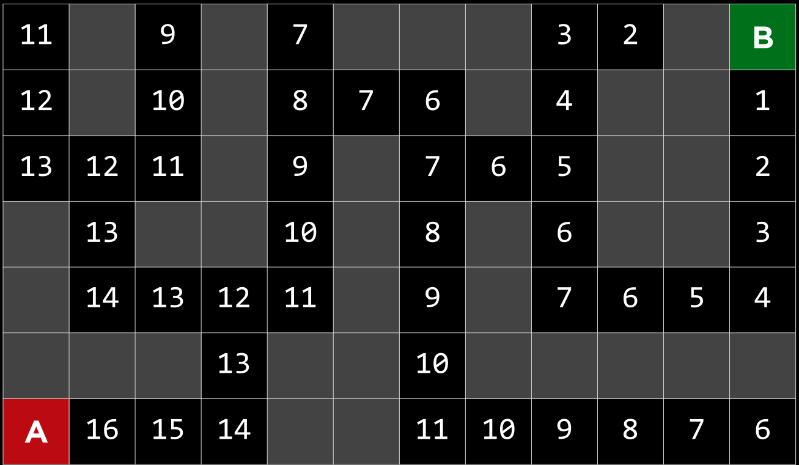
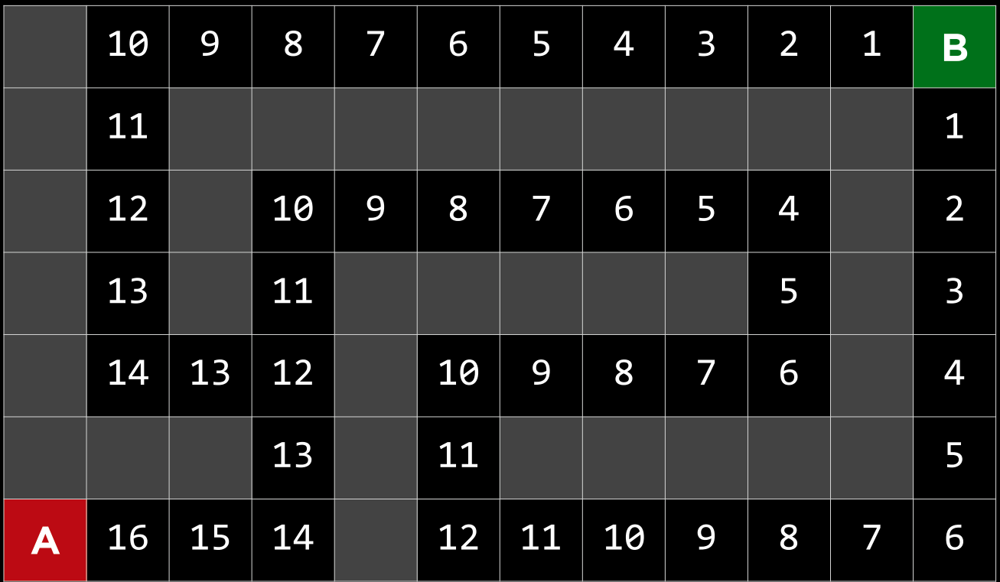
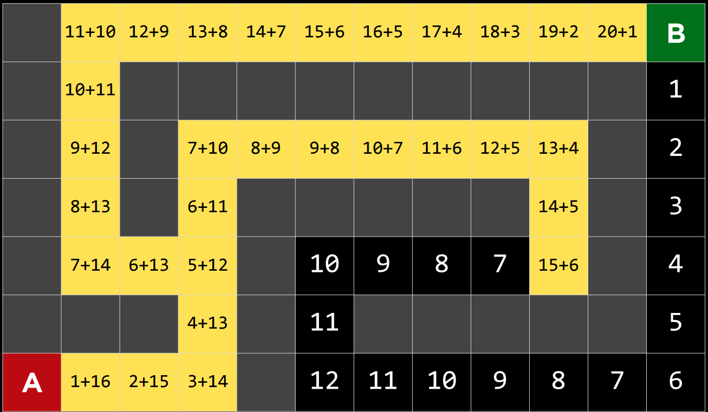

[Refrence Lecture CS50](https://cs50.harvard.edu/ai/weeks/0/)

# Informed Search:

Search strategy that uses problem-specific knowlegdge to find solutions more efficiently.

## 1. Gready Best-First search
Breadth-first and depth-first are both uninformed search algorithms. That is, these algorithms do not utilize any knowledge about the problem that they did not acquire through their own exploration. However, most often is the case that some knowledge about the problem is, in fact, available. For example, when a human maze-solver enters a junction, the human can see which way goes in the general direction of the solution and which way does not. AI can do the same. A type of algorithm that considers additional knowledge to try to improve its performance is called an informed search algorithm.

Greedy best-first search expands the node that is the closest to the goal, as determined by a heuristic function h(n). As its name suggests, the function estimates how close to the goal the next node is, but it can be mistaken. The efficiency of the greedy best-first algorithm depends on how good the heuristic function is. For example, in a maze, an algorithm can use a heuristic function that relies on the Manhattan distance between the possible nodes and the end of the maze. The Manhattan distance ignores walls and counts how many steps up, down, or to the sides it would take to get from one location to the goal location. This is an easy estimation that can be derived based on the (x, y) coordinates of the current location and the goal location.

### Maze4

### Manhattan Distance

Manhattan Distance
However, it is important to emphasize that, as with any heuristic, it can go wrong and lead the algorithm down a slower path than it would have gone otherwise. It is possible that an uninformed search algorithm will provide a better solution faster, but it is less likely to do so than an informed algorithm.

Search algorithm that expands the node that is closest to the goal, as estimate by a heuristic function $$h(n)$$
### Manhattan Distance : heuristics Maze4

### Maze 5

## 2. A* search

A development of the greedy best-first algorithm, A* search considers not only h(n), the estimated cost from the current location to the goal, but also g(n), the cost that was accrued until the current location. By combining both these values, the algorithm has a more accurate way of determining the cost of the solution and optimizing its choices on the go. The algorithm keeps track of (cost of path until now + estimated cost to the goal), and once it exceeds the estimated cost of some previous option, the algorithm will ditch the current path and go back to the previous option, thus preventing itself from going down a long, inefficient path that h(n) erroneously marked as best.

Yet again, since this algorithm, too, relies on a heuristic, it is as good as the heuristic that it employs. It is possible that in some situations it will be less efficient than greedy best-first search or even the uninformed algorithms. For A* search to be optimal, the heuristic function, h(n), should be:
1. Admissible, or never overestimating the true cost, and
2. Consistent, which means that the estimated path cost to the goal of a new node in addition to the cost of transitioning to it from the previous node is greater or equal to the estimated path cost to the goal of the previous node. To put it in an equation form, h(n) is consistent if for every node n and successor node n’ with step cost c, h(n) ≤ h(n’) + c.

