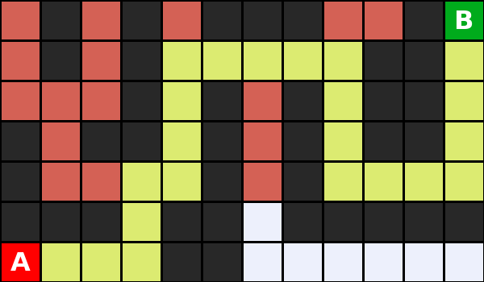
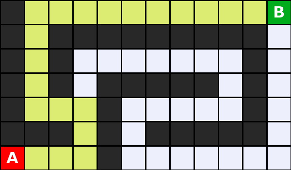

# Informed Search Algorithms

[Reference: CS50 AI - Search](https://cs50.harvard.edu/ai/weeks/0/)

## Table of Contents

- [Introduction](#introduction)
- [Key Concepts](#key-concepts)
- [Algorithms](#algorithms)
  - [Greedy Best-First Search](#1-greedy-best-first-search)
  - [A* Search](#2-a-search)
- [Heuristics](#heuristics)
  - [Manhattan Distance](#manhattan-distance)
  - [Admissible Heuristics](#admissible-heuristics-never-overestimate)
  - [Consistent Heuristics](#consistent-heuristics-triangle-inequality)
- [Algorithm Comparison](#algorithm-comparison)
- [Examples](#examples)
- [Files in This Directory](#files-in-this-directory)
- [How to Run](#how-to-run)

---

## Introduction

**Informed Search** is a search strategy that uses **problem-specific knowledge** (heuristics) to find solutions more efficiently than uninformed search algorithms like DFS and BFS.

| Search Type | Uses Heuristic | Example Algorithms |
|-------------|----------------|-------------------|
| **Uninformed** | No | DFS, BFS |
| **Informed** | Yes | Greedy Best-First, A* |

When a human solves a maze, they can see which direction leads toward the goal. Informed search algorithms do the same by using a **heuristic function** to estimate distance to the goal.

---

## Key Concepts

| Symbol | Name | Description |
|--------|------|-------------|
| **g(n)** | Path Cost | Actual cost from start to node n |
| **h(n)** | Heuristic | Estimated cost from node n to goal |
| **f(n)** | Evaluation | Function to decide which node to expand |

**The key difference between algorithms is how they calculate f(n):**

| Algorithm | f(n) | Behavior |
|-----------|------|----------|
| Greedy Best-First | h(n) | Expands node that *looks* closest to goal |
| A* | g(n) + h(n) | Expands node with lowest *total* estimated cost |

---

## Algorithms

### 1. Greedy Best-First Search

Greedy Best-First Search expands the node that appears **closest to the goal**, using only the heuristic h(n).

**Evaluation Function:** `f(n) = h(n)`

#### Properties

| Property | Value | Explanation |
|----------|-------|-------------|
| **Optimal** | No | May not find the shortest path |
| **Complete** | Yes* | Will find a solution if one exists (*with cycle detection) |
| **Time** | O(b^m) | Worst case, explores all nodes |
| **Space** | O(b^m) | Stores all nodes in memory |

#### Pseudocode

```
function GreedyBestFirst(start, goal):
    frontier = PriorityQueue()                    # Ordered by h(n)
    frontier.add(start, h(start))
    explored = {}

    while frontier is not empty:
        node = frontier.pop()                     # Get node with lowest h(n)

        if node == goal:
            return reconstruct_path(node)

        explored.add(node)

        for each neighbor of node:
            if neighbor not in explored and neighbor not in frontier:
                neighbor.parent = node
                frontier.add(neighbor, h(neighbor))

    return failure
```

#### Why Greedy is NOT Optimal

Greedy only considers h(n) - the estimated distance to goal. It ignores how far it has already traveled (g(n)). This can lead it down a path that *looks* good but is actually longer.

```
Example: Greedy might choose path A because h(A) < h(B)
         But path B could be shorter overall!

         Start ----[5]---- A (h=3) ----[10]---- Goal
              \                                  /
               \---[2]---- B (h=5) ----[3]-----/

         Greedy picks A (h=3 < h=5), total cost = 5+10 = 15
         Optimal path through B, total cost = 2+3 = 5
```

---

### 2. A* Search

A* Search considers **both** the path cost g(n) **and** the heuristic h(n), finding the optimal balance.

**Evaluation Function:** `f(n) = g(n) + h(n)`

#### Properties

| Property | Value | Explanation |
|----------|-------|-------------|
| **Optimal** | Yes* | Finds shortest path (*if heuristic is admissible) |
| **Complete** | Yes | Will find a solution if one exists |
| **Time** | O(b^d) | Depends on heuristic quality |
| **Space** | O(b^d) | Stores all nodes in memory |

#### Pseudocode

```
function AStar(start, goal):
    frontier = PriorityQueue()                    # Ordered by f(n) = g(n) + h(n)
    frontier.add(start, g(start) + h(start))
    explored = {}

    while frontier is not empty:
        node = frontier.pop()                     # Get node with lowest f(n)

        if node == goal:
            return reconstruct_path(node)

        explored.add(node)

        for each neighbor of node:
            new_g = node.g + step_cost

            if neighbor not in explored:
                if neighbor not in frontier:
                    neighbor.g = new_g
                    neighbor.parent = node
                    frontier.add(neighbor, new_g + h(neighbor))
                elif new_g < neighbor.g:          # Found better path
                    neighbor.g = new_g
                    neighbor.parent = node
                    frontier.update(neighbor, new_g + h(neighbor))

    return failure
```

#### Why A* is Optimal

A* keeps track of the **actual cost** g(n) plus the **estimated remaining cost** h(n). If a path becomes too expensive (high g(n)), A* will abandon it and try alternatives, even if they initially looked worse (higher h(n)).

---

## Heuristics

A **heuristic** is an estimate of the cost to reach the goal. Different problems require different heuristics.

| Problem | Common Heuristics |
|---------|------------------|
| Maze/Grid Navigation | Manhattan Distance, Euclidean Distance |
| 8-Puzzle | Misplaced tiles, Manhattan Distance of tiles |
| Traveling Salesman | Minimum Spanning Tree cost |
| Route Finding (Maps) | Straight-line distance |
| Game Playing (Chess) | Piece values, position evaluation |

### Manhattan Distance

For grid-based movement (up, down, left, right), **Manhattan Distance** is the standard heuristic:

```
h(n) = |row_current - row_goal| + |col_current - col_goal|
```


**Example:**
```
Start A at (6, 0), Goal B at (0, 11)
h(A) = |6 - 0| + |0 - 11| = 6 + 11 = 17
```

---

### Admissible Heuristics (Never Overestimate)

A heuristic is **admissible** if it **never overestimates** the true cost to reach the goal.

```
h(n) ≤ actual cost from n to goal
```

**Why is this important?** If h(n) overestimates, A* might skip the optimal path thinking it's too expensive!

#### Example from Maze4:

```
 # # ###  #B   ← Goal B at (0, 11)
 # #     ##
   # # # ##
# ## # # ##
#    # #
### ## #####
A   ##         ← Start A at (6, 0)
```

Consider node at position **(4, 4)**:
- Manhattan Distance: h(4,4) = |4-0| + |4-11| = 4 + 7 = **11**
- Actual shortest path to B (navigating around walls) = **19 steps**

Since **11 ≤ 19**, Manhattan distance is admissible here!

**Manhattan Distance is ALWAYS admissible for mazes** because:
- It calculates the straight-line grid distance (ignoring walls)
- The actual path can only be **equal to or longer** (due to walls)
- It can never be shorter than Manhattan distance

---

### Consistent Heuristics (Triangle Inequality)

A heuristic is **consistent** (also called **monotonic**) if for every node n and its successor n' with step cost c:

```
h(n) ≤ h(n') + c
```

This means: the estimated cost from n should not exceed (estimated cost from n' + cost to reach n')

#### Visual Explanation

```
        h(n)
    n ---------> Goal
    |            ↗
  c |      h(n')
    ↓      /
    n' ---/

Triangle Inequality: h(n) ≤ c + h(n')
The direct estimate should not exceed going through n'
```

#### Example from Maze4:

**Move from (6, 1) to (6, 2):**
```
Position (6, 1): h = |6-0| + |1-11| = 6 + 10 = 16
Position (6, 2): h = |6-0| + |2-11| = 6 + 9  = 15
Step cost c = 1

Check: h(6,1) ≤ h(6,2) + c
       16 ≤ 15 + 1
       16 ≤ 16 ✓ Consistent!
```

**Move from (5, 3) to (4, 3) (moving UP):**
```
Position (5, 3): h = |5-0| + |3-11| = 5 + 8 = 13
Position (4, 3): h = |4-0| + |3-11| = 4 + 8 = 12
Step cost c = 1

Check: h(5,3) ≤ h(4,3) + c
       13 ≤ 12 + 1
       13 ≤ 13 ✓ Consistent!
```

**Manhattan Distance is ALWAYS consistent** because:
- Moving one step changes h(n) by at most 1 (either +1, -1, or 0)
- Since step cost c = 1, the inequality h(n) ≤ h(n') + 1 always holds

### Summary: Admissible vs Consistent

| Property | Definition | Manhattan Distance |
|----------|------------|-------------------|
| **Admissible** | h(n) ≤ actual cost | Always (ignores walls) |
| **Consistent** | h(n) ≤ h(n') + c | Always (changes by ≤1 per step) |

**Important:** A consistent heuristic is always admissible, but an admissible heuristic is not always consistent.

---

## Algorithm Comparison

| Property | DFS | BFS | Greedy Best-First | A* |
|----------|-----|-----|-------------------|-----|
| **Data Structure** | Stack | Queue | Priority Queue (by h) | Priority Queue (by g+h) |
| **Evaluation** | - | - | f(n) = h(n) | f(n) = g(n) + h(n) |
| **Optimal** | No | Yes* | No | Yes** |
| **Complete** | No | Yes | Yes* | Yes |
| **Uses Heuristic** | No | No | Yes | Yes |
| **Best For** | Memory-limited | Shortest path (unweighted) | Quick solution | Optimal solution |

*For unweighted graphs / with cycle detection
**With admissible heuristic

---

## Examples

### Maze4


**Heuristic values (Manhattan Distance to goal B):**


### A* vs Greedy Solutions on Maze4

| Algorithm | States Explored | Path Length | Optimal? |
|-----------|-----------------|-------------|----------|
| A* | ~20 | 21 | Yes |
| Greedy | ~15 | 21-25 | Not guaranteed |

**A* Solution:**



**A* with Explored States (orange = explored, yellow = solution):**


### Maze5


**A* Solution:**



---

## Files in This Directory

| File | Description |
|------|-------------|
| `maze_greedy_best_A_star.py` | Python implementation of Greedy and A* algorithms |
| `DSE313_2026_AI_A*.ipynb` | Step-by-step Jupyter notebook tutorial |
| `maze4.txt`, `maze5.txt` | Maze files (text format) |
| `Maze4.png`, `Maze5.png` | Maze visualization images |
| `Heuristics_maze4.png` | Manhattan distance heuristic values |
| `maze4_astar.png`, `maze4_greedy.png` | Solution output images |
| `maze4_astar_explored.png`, etc. | Solution with explored states |
| `A*_h_g.png` | A* evaluation function visualization |

---

## How to Run

### Command Line

```bash
# Run A* search (default)
python maze_greedy_best_A_star.py maze4.txt

# Run Greedy Best-First search
python maze_greedy_best_A_star.py maze4.txt greedy

# Run A* search explicitly
python maze_greedy_best_A_star.py maze5.txt astar
```

### Output

The script will:
1. Display the maze in the terminal
2. Show the solution path with `*` characters
3. Report states explored and path length
4. Save a PNG image of the solution

### Jupyter Notebook

Open `DSE313_2026_AI_A*.ipynb` for an interactive step-by-step tutorial covering:

1. Introduction to Informed Search
2. Parsing the Maze
3. States, Actions, and Neighbors
4. The Node Class (with g, h, f costs)
5. Priority Queue Frontier
6. Greedy and A* Implementations
7. Complete Maze Class
8. Testing on Multiple Mazes

---

## References

- [CS50 AI - Search](https://cs50.harvard.edu/ai/weeks/0/)
- Russell, S., & Norvig, P. - *Artificial Intelligence: A Modern Approach*
